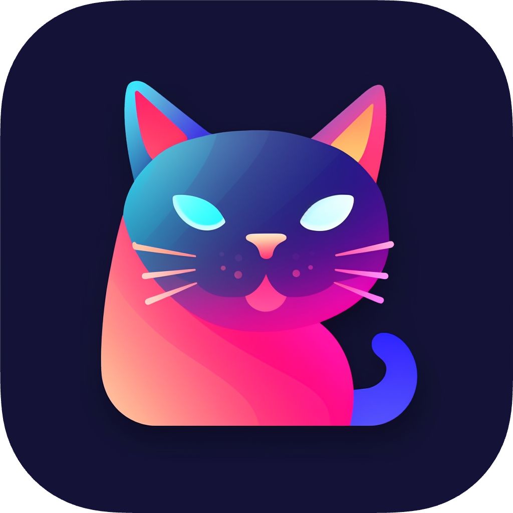
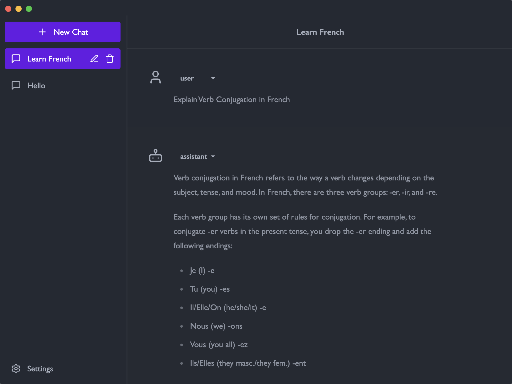
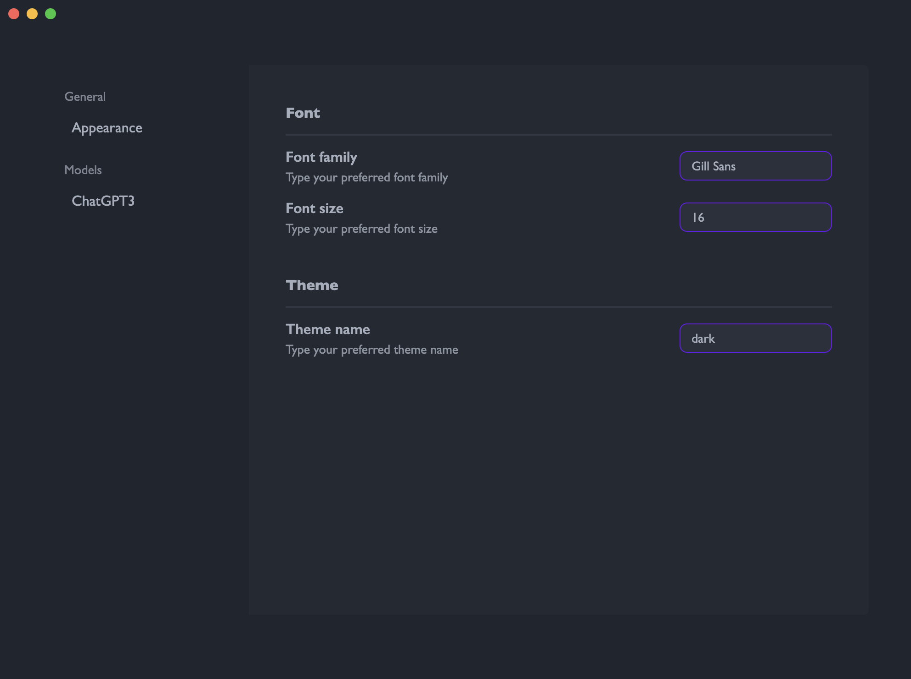

# Chatter

&nbsp;

  

&nbsp;

    <i>A customizable LLM Chat App which considers models and actions all as plugins</i>

&nbsp;

  
  
  
  
  

&nbsp;

## Introduction

**Chatter** has ability to integrate with various LLMs like ChatGPT, GPT4ALL, and others, which means you can integrate any LLMs as **Model** plugins. In addition, the app enables not just models interaction, but has ability to enable models to act or behave, such as book a restaurant with the support of **Action** plugins. Thus, thanks to its extensibility, users can write and provide their own plugins to integrate with various models and to support more actions.

**_Give it a try!_** 🎉

## Features

* Cutomizable appearance (e.g. theme, font)
* Advanced Chat UI
* Built-in and extendable **Model** plugins
* Built-in and extendable **Action** plugins
* And more...

## Showcases

Current there are many themes supported and in the future there will be even more!

This showcase is in **dark** theme.

| Home | Settings |
|:-------------------------:|:-------------------------:|
||  |

## Status

**Chatter** is currently in active development! 👨‍💻

**_Note: There will be release when it's ready. If you are not patient to wait for it, you can clone this repo and build it._**
